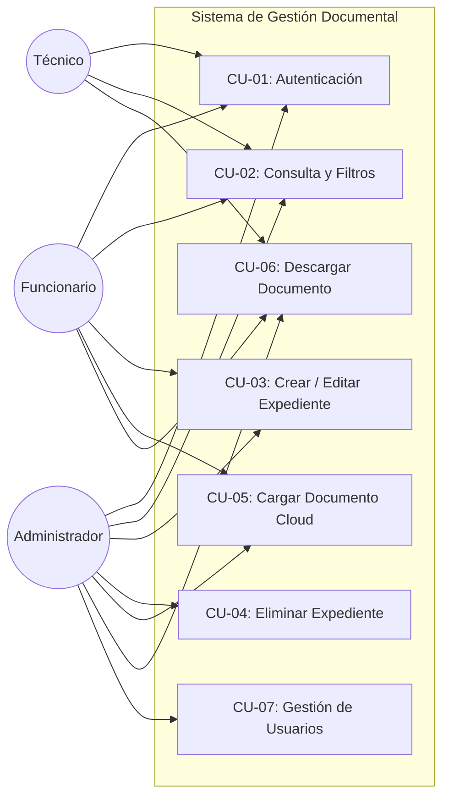

# Sistema de Gestión Documental - Alcaldía Municipal de Samaná

Prototipo de software arquitectónico para la digitalización, custodia y administración del acervo documental municipal, desarrollado bajo principios de **Domain-Driven Design (DDD)**, **SOLID**, **DRY** y patrones de diseño para computación en la nube.

> **Acceso a la Aplicación en la Nube (GitHub Pages):**  
> 🔗 [https://octavosemestre.github.io/Sistema-de-Gesti-n-Documental/](https://octavosemestre.github.io/Sistema-de-Gesti-n-Documental/)

---

## 1. Guía de Ingreso y Perfiles de Usuario (RBAC)

La plataforma cuenta con un sistema de **Control de Acceso Basado en Roles (RBAC)** gestionado a través del patrón de diseño *Strategy*. Para ingresar, seleccione el perfil deseado en el formulario de inicio de sesión:

| Perfil / Rol | Correo Electrónico | Contraseña | Alcance de Permisos |
| :--- | :--- | :---: | :--- |
| **Administrador** | `admin@samana.gov.co` | `123456` | **Acceso Total**: Crear, editar, consultar y eliminar expedientes; cargar y eliminar documentos digitales en la nube; acceso al módulo de administración de usuarios. |
| **Funcionario** | `funcionario@samana.gov.co` | `123456` | **Operativo**: Crear y modificar expedientes; adjuntar documentos PDF a la bóveda cloud; consultar y descargar archivos. *Sin permisos de eliminación ni gestión de usuarios.* |
| **Técnico** | `tecnico@samana.gov.co` | `123456` | **Consulta y Auditoría**: Búsqueda en tiempo real de expedientes en el archivo municipal; visualización y descarga de documentos digitales. *Modo solo lectura.* |

---

## 2. Funcionamiento Integral de la Plataforma

La aplicación opera como una **Single Page Application (SPA)** modular y reactiva estructurada en 4 módulos operativos:

```
[ Pantalla de Login ] ──(Autenticación RBAC)──> [ Panel Principal ]
                                                        │
         ┌──────────────────────────────────────────────┼────────────────────────────────────────┐
         ▼                                              ▼                                        ▼
[ Consulta y Filtros ]                       [ Registro y Edición ]                  [ Bóveda Documental Cloud ]
- Búsqueda en tiempo real                   - Formulario estructurado TRD            - Carga de PDFs (S3 Storage)
- Badges por tipo de archivo                - Validación de fechas e invariantes     - Descarga con URL segura
- Acciones según rol activo                 - Actualización de agregados             - Eliminación (Solo Admin)
```

### 2.1 Módulo 1: Autenticación y Gestión de Sesión
1. El usuario ingresa sus credenciales y selecciona su rol operativo.
2. La capa de aplicación (`AuthService`) valida las credenciales y resuelve la estrategia de permisos (`RoleStrategy`) correspondiente.
3. El estado de sesión se almacena de forma segura en `sessionStorage` y se emite un evento global (`AUTH_STATE_CHANGED`) que adapta la interfaz de usuario dinámicamente según los privilegios otorgados.

### 2.2 Módulo 2: Consulta de Expedientes y Búsqueda en Tiempo Real
* **Catálogo de Archivo**: Lista los expedientes clasificados por Serie, Subserie y Ubicación física (*Archivo de Gestión*, *Archivo Central*, *Archivo Histórico*).
* **Filtro Multicriterio**: La barra de búsqueda filtra instantáneamente por código, serie, subserie u observaciones sin recargar la página ni realizar peticiones bloqueantes.
* **Contador de Documentos**: Muestra en tiempo real la cantidad de archivos electrónicos asociados a cada expediente.

### 2.3 Módulo 3: Registro y Modificación de Expedientes (TRD)
1. Al hacer clic en **"+ Nuevo Expediente"** (disponible para *Administrador* y *Funcionario*), se despliega el formulario de retención documental.
2. **Validaciones de Dominio**:
   * Código de expediente único y obligatorio.
   * Series y Subseries normalizadas.
   * Coherencia cronológica (la fecha final no puede ser anterior a la fecha inicial).
3. Al guardar, el agregado `RecordArchive` se persiste a través del repositorio (`RecordRepository`) y se notifica al sistema mediante un toast de confirmación.
4. **Edición**: Al pulsar "Editar", el formulario se precarga con los datos del expediente seleccionado permitiendo su actualización controlada.

### 2.4 Módulo 4: Bóveda Documental Cloud (Gestión de Archivos Digitales)
1. Al pulsar el botón **"Documentos"** en cualquier expediente, se abre el visor de la bóveda digital.
2. **Carga a la Nube (AWS S3 Adapter)**:
   * El usuario selecciona un archivo digital (formato PDF).
   * El servicio `CloudStorageAdapter` procesa el archivo, genera un identificador de objeto cloud (`s3://samana-document-vault-prod/...`) y persiste el contenido en el almacén de objetos.
3. **Descarga Segura**: Los usuarios con permiso pueden descargar directamente el archivo digital original almacenado.
4. **Eliminación**: Exclusiva para el rol *Administrador*, asegurando la custodia y trazabilidad de los documentos oficiales.

---

## 3. Arquitectura de Software

La aplicación sigue una **Arquitectura Limpia / Hexagonal** modular en capas desacopladas:

```
Sistema-de-Gesti-n-Documental/
├── index.html                   # Vista principal semántica y dinámica
├── styles.css                   # Sistema de diseño responsivo y accesible
├── README.md                    # Documentación técnica y manual de usuario
└── js/
    ├── domain/                  # DOMINIO: Modelos, Entidades, Value Objects y RBAC
    │   ├── roles.js             # Enums Role/Permission y Strategy Pattern
    │   └── models.js            # Entidades RecordArchive, DocumentFile, User y RecordFactory
    ├── application/             # APLICACIÓN: Casos de uso y orquestación
    │   ├── authService.js       # Autenticación y evaluación de políticas de seguridad
    │   └── recordService.js     # Lógica de negocio, TRD y carga documental
    ├── infrastructure/          # INFRAESTRUCTURA: Persistencia y adaptadores
    │   ├── eventBus.js          # Observer Pattern (EventBus desacoplado)
    │   ├── storageAdapter.js    # Adapter Pattern para Cloud Storage (AWS S3 / Vault)
    │   └── recordRepository.js  # Repository Pattern con soporte de Cache-Aside
    └── app.js                   # PRESENTACIÓN: Controlador y vinculación reactiva
```

---

## 4. Patrones de Diseño Aplicados

| Patrón | Clasificación | Archivo de Implementación | Justificación Técnica |
| :--- | :--- | :--- | :--- |
| **Repository Pattern** | Estructural / DDD | `js/infrastructure/recordRepository.js` | Desacopla la lógica de negocio de la fuente de persistencia (LocalStorage, DynamoDB o PostgreSQL). |
| **Strategy Pattern** | Comportamiento | `js/domain/roles.js` | Modela las políticas de autorización de cada rol sin utilizar condicionales anidados, cumpliendo el principio Open/Closed. |
| **Factory Method** | Creacional | `js/domain/models.js` | Centraliza la instanciación e invariantes de los agregados `RecordArchive` y `DocumentFile`. |
| **Observer Pattern** | Comportamiento | `js/infrastructure/eventBus.js` | Permite la comunicación asíncrona y reactiva entre capas (`RECORD_CREATED`, `DOCUMENT_ATTACHED`, `UI_NOTIFICATION`). |
| **Adapter Pattern** | Estructural / Cloud | `js/infrastructure/storageAdapter.js` | Implementa la interfaz `IStorageService` para interactuar con almacenamiento de objetos en la nube (AWS S3 / Azure Blob). |
| **Cache-Aside Pattern** | Arquitectura Cloud | `js/infrastructure/recordRepository.js` | Mantiene una caché en memoria sincronizada para minimizar costos y latencia de lecturas en la nube. |

---

## 5. Diagramas UML

### 5.1 Diagrama de Casos de Uso


### 5.2 Diagrama de Despliegue en la Nube
```mermaid
flowchart TB
    subgraph Client Tier
        Browser["Navegador Web (SPA Vanilla JS ES6)"]
    end

    subgraph Cloud Edge Tier
        CDN["GitHub Pages CDN / Fastly Edge Network"]
        StaticBucket["Static Web Hosting (HTML/CSS/JS Modules)"]
    end

    subgraph Cloud Storage Tier
        S3Docs[("Amazon S3 Simulated Vault (s3://samana-document-vault-prod)")]
        LocalStore[("Encrypted Local Repository / Cache-Aside")]
    end

    Browser -->|HTTPS GET (Edge)| CDN
    CDN --> StaticBucket
    Browser -->|IStorageService Adapter| S3Docs
    Browser -->|IRecordRepository| LocalStore
```

---

## 6. Instrucciones de Ejecución

### Ejecución en la Nube (Producción)
Acceder directamente mediante cualquier navegador a:
👉 [https://octavosemestre.github.io/Sistema-de-Gesti-n-Documental/](https://octavosemestre.github.io/Sistema-de-Gesti-n-Documental/)

### Ejecución Local
1. Clonar el repositorio:
   ```bash
   git clone https://github.com/octavosemestre/Sistema-de-Gesti-n-Documental.git
   cd Sistema-de-Gesti-n-Documental
   ```
2. Cambiar a la rama de arquitectura limpia:
   ```bash
   git checkout feature/clean-architecture
   ```
3. Iniciar un servidor HTTP local:
   ```bash
   python3 -m http.server 8080
   ```
4. Abrir en el navegador: `http://localhost:8080`.
