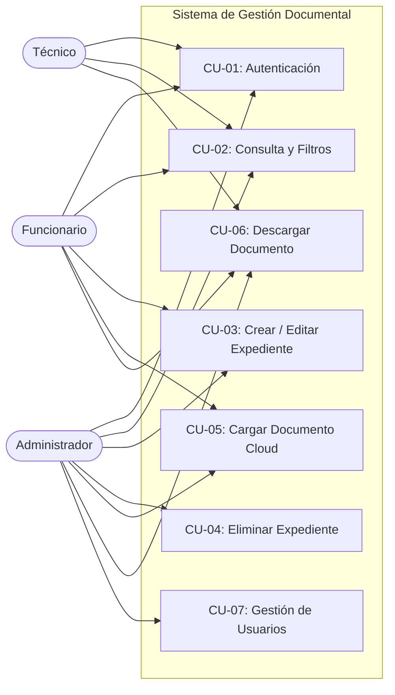
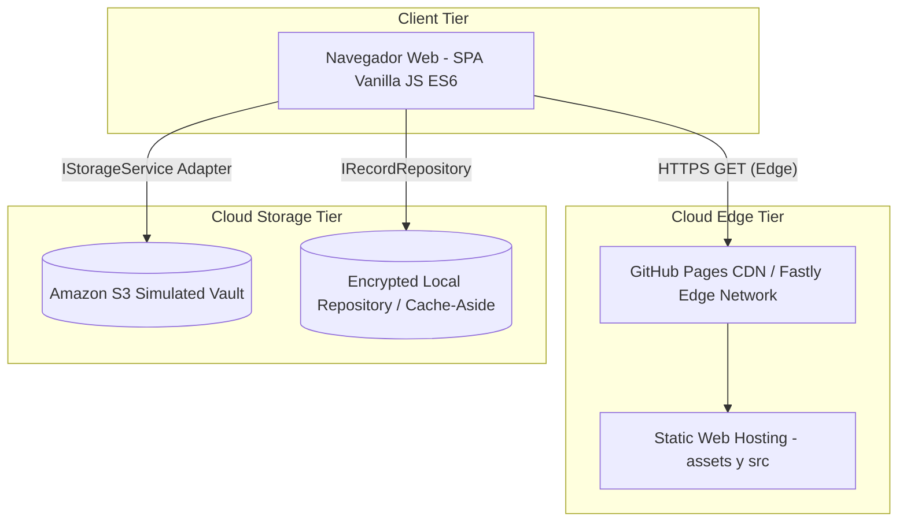

# Sistema de Gestión Documental - Alcaldía Municipal de Samaná

Prototipo de software arquitectónico para la digitalización, custodia y administración del acervo documental municipal, desarrollado bajo principios de **Domain-Driven Design (DDD)**, **SOLID**, **DRY** y patrones de diseño para computación en la nube.

> **Acceso a la Aplicación en la Nube (GitHub Pages):**  
> 🔗 [https://octavosemestre.github.io/Sistema-de-Gesti-n-Documental/](https://octavosemestre.github.io/Sistema-de-Gesti-n-Documental/)

---

## 1. Guía de Ejecución en Entorno Local

Para ejecutar la aplicación localmente en su estación de trabajo, clone el repositorio principal desde la rama **`main`**:

### Paso 1: Clonar el Repositorio
```bash
git clone https://github.com/octavosemestre/Sistema-de-Gesti-n-Documental.git
cd Sistema-de-Gesti-n-Documental
```

*(Por defecto, el repositorio se posiciona en la rama **`main`**).*

---

### Paso 2: Iniciar un Servidor Web Local
Debido a que el proyecto utiliza módulos nativos de JavaScript (**ES6 Modules** con `type="module"`), los navegadores web modernos exigen que los archivos se sirvan a través del protocolo HTTP/HTTPS (y no mediante `file://`) por políticas de seguridad CORS del navegador.

Seleccione cualquiera de las siguientes alternativas según las herramientas instaladas en su equipo:

#### Opción A: Con Python 3 (Recomendada y universal en Linux/macOS/Windows)
```bash
python3 -m http.server 8080
```
*Abra en su navegador:* `http://localhost:8080`

#### Opción B: Con Node.js (`npx`)
```bash
# Sin necesidad de instalar paquetes globales
npx serve .
# o alternativamente:
npx http-server -p 8080
```
*Abra en su navegador:* `http://localhost:3000` o `http://localhost:8080`

#### Opción C: Con Visual Studio Code (Extensión Live Server)
1. Abra la carpeta del proyecto en VS Code.
2. Instale la extensión **Live Server** (de Ritwick Dey).
3. Haga clic derecho sobre `index.html` y seleccione **"Open with Live Server"**.

#### Opción D: Con PHP (si cuenta con entorno LAMP/XAMPP)
```bash
php -S localhost:8080
```

---

## 2. Organización y Claridad de la Estructura de Directorios

La estructura de carpetas ha sido diseñada siguiendo el estándar de **Arquitectura Limpia / Puertos y Adaptadores (Hexagonal)**, lo que garantiza nombres autodescriptivos, alta cohesión y bajo acoplamiento:

```text
Sistema-de-Gesti-n-Documental/
├── index.html                   # Vista principal semántica, accesible y dinámica
├── styles.css                   # Sistema de diseño responsivo y paleta institucional
├── README.md                    # Documentación técnica, manual de usuario y diagramas
├── logo.png                     # Escudo y logotipo oficial de la Alcaldía de Samaná
└── js/                          # Núcleo modular en JavaScript ES6
    ├── domain/                  # CAPA 1: DOMINIO (Reglas de negocio puras e invariantes)
    │   ├── roles.js             # Enums Role/Permission y Strategy Pattern para RBAC
    │   └── models.js            # Entidades RecordArchive, DocumentFile, User y RecordFactory
    ├── application/             # CAPA 2: APLICACIÓN (Casos de uso y orquestación)
    │   ├── authService.js       # Autenticación y evaluación de políticas de seguridad
    │   └── recordService.js     # Gestión de expedientes, TRD y carga documental
    ├── infrastructure/          # CAPA 3: INFRAESTRUCTURA (Adaptadores y persistencia)
    │   ├── eventBus.js          # Observer Pattern (EventBus desacoplado)
    │   ├── storageAdapter.js    # Adapter Pattern para Cloud Storage (AWS S3 Vault)
    │   └── recordRepository.js  # Repository Pattern con soporte de Cache-Aside
    └── app.js                   # CAPA 4: PRESENTACIÓN (Controlador reactivo y binding UI)
```

### ¿Por qué esta organización es óptima y clara?
1. **Nombres Semánticos en Inglés Técnico**: Cada carpeta y archivo describe con precisión su única responsabilidad arquitectónica (`domain`, `application`, `infrastructure`, `roles.js`, `storageAdapter.js`).
2. **Independencia Tecnológica**: Si se sustituye la interfaz visual o la base de datos, el código del dominio (`js/domain/`) permanece 100% intacto.
3. **Cero Dependencias Pesadas**: Funciona directamente en cualquier navegador moderno sin requerir empaquetadores como Webpack o Vite.

---

## 3. Credenciales y Perfiles de Acceso (RBAC)

La plataforma implementa un modelo de **Control de Acceso Basado en Roles (RBAC)** evaluado a nivel de dominio mediante el patrón *Strategy*:

| Perfil / Rol | Correo Electrónico | Contraseña | Alcance de Permisos |
| :--- | :--- | :---: | :--- |
| **Administrador** | `admin@samana.gov.co` | `123456` | **Acceso Total**: Crear, editar, consultar y eliminar expedientes; cargar y eliminar documentos digitales en la nube; acceso al módulo de administración de usuarios. |
| **Funcionario** | `funcionario@samana.gov.co` | `123456` | **Operativo**: Crear y modificar expedientes; adjuntar documentos PDF a la bóveda cloud; consultar y descargar archivos. *Sin permisos de eliminación ni gestión de usuarios.* |
| **Técnico** | `tecnico@samana.gov.co` | `123456` | **Consulta y Auditoría**: Búsqueda en tiempo real de expedientes en el archivo municipal; visualización y descarga de documentos digitales. *Modo solo lectura.* |

---

## 4. Funcionamiento de los Módulos de la Plataforma

```
[ Pantalla de Login ] ──(Autenticación RBAC)──> [ Panel Principal ]
                                                        │
         ┌──────────────────────────────────────────────┼────────────────────────────────────────┐
         ▼                                              ▼                                        ▼
[ Consulta y Filtros ]                       [ Registro y Edición ]                  [ Bóveda Documental Cloud ]
- Búsqueda en tiempo real                   - Formulario estructurado TRD            - Carga de PDFs (S3 Storage)
- Badges por tipo de archivo                - Validación de fechas e invariantes     - Descarga con URL segura
- Acciones según rol activo                 - Actualización de agregados             - Eliminación (Solo Admin)
```

1. **Módulo 1 (Autenticación y Sesión)**: Gestión de tokens de sesión en `sessionStorage` y emisión de eventos `AUTH_STATE_CHANGED` para adaptar dinámicamente la UI según el rol.
2. **Módulo 2 (Catálogo de Expedientes y Búsqueda Multicriterio)**: Listado ordenado por Tablas de Retención Documental (TRD) con filtrado instantáneo por código, serie, subserie o ubicación física (*Archivo de Gestión*, *Archivo Central*, *Archivo Histórico*).
3. **Módulo 3 (Registro y Modificación TRD)**: Formulario con validación de invariantes de dominio (código obligatorio, coherencia cronológica de fechas inicial y final).
4. **Módulo 4 (Bóveda Documental Cloud)**: Carga asíncrona de archivos PDF procesados mediante el adaptador `CloudStorageAdapter`, asignación de URI de almacenamiento (`s3://samana-document-vault-prod/...`) y descarga segura de documentos.

---

## 5. Patrones de Diseño Implementados

| Patrón | Clasificación | Archivo de Implementación | Justificación Técnica |
| :--- | :--- | :--- | :--- |
| **Repository Pattern** | Estructural / DDD | `js/infrastructure/recordRepository.js` | Desacopla la lógica de negocio de la fuente de persistencia (LocalStorage, DynamoDB o PostgreSQL). |
| **Strategy Pattern** | Comportamiento | `js/domain/roles.js` | Modela las políticas de autorización de cada rol sin utilizar condicionales anidados, cumpliendo el principio Open/Closed. |
| **Factory Method** | Creacional | `js/domain/models.js` | Centraliza la instanciación e invariantes de los agregados `RecordArchive` y `DocumentFile`. |
| **Observer Pattern** | Comportamiento | `js/infrastructure/eventBus.js` | Permite la comunicación asíncrona y reactiva entre capas (`RECORD_CREATED`, `DOCUMENT_ATTACHED`, `UI_NOTIFICATION`). |
| **Adapter Pattern** | Estructural / Cloud | `js/infrastructure/storageAdapter.js` | Implementa la interfaz `IStorageService` para interactuar con almacenamiento de objetos en la nube (AWS S3 / Azure Blob). |
| **Cache-Aside Pattern** | Arquitectura Cloud | `js/infrastructure/recordRepository.js` | Mantiene una caché en memoria sincronizada para minimizar costos y latencia de lecturas en la nube. |

---

## 6. Diagramas UML

### 6.1 Diagrama de Casos de Uso


### 6.2 Diagrama de Despliegue en la Nube

