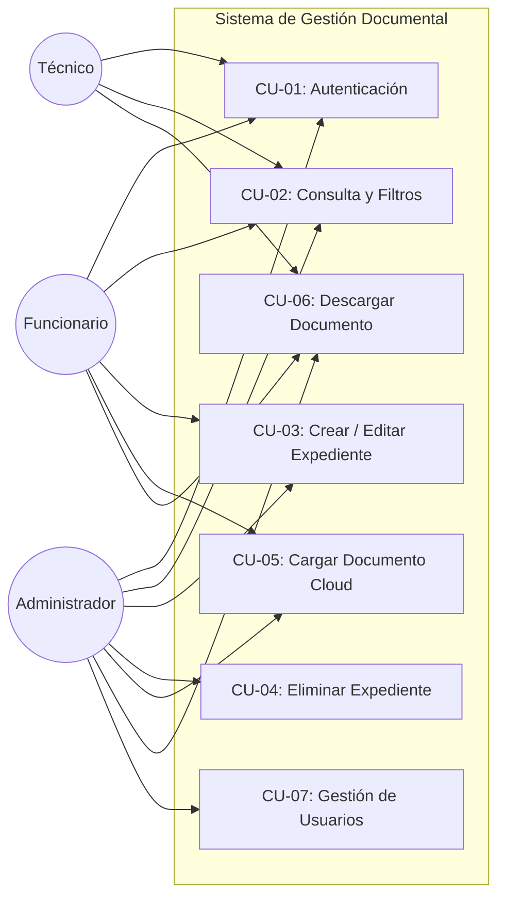

# Sistema de Gestión Documental - Alcaldía Municipal de Samaná

Prototipo de software arquitectónico para la digitalización, custodia y administración de expedientes y documentos electrónicos, diseñado bajo principios de Arquitectura Limpia, **Domain-Driven Design (DDD)**, **SOLID**, **DRY** y patrones para entornos de computación en la nube.

---

## 1. Contexto y Caso de Estudio

La **Alcaldía Municipal de Samaná** requiere modernizar la custodia de su acervo documental físico hacia un sistema de gestión documental electrónico. La solución permite estructurar expedientes según las Tablas de Retención Documental (TRD), asociar documentos digitalizados (PDFs) en almacenamiento de objetos en la nube y aplicar control de acceso granular basado en roles (RBAC).

---

## 2. Arquitectura de Software

La aplicación está diseñada siguiendo una **Arquitectura en Capas / Hexagonal** desacoplada mediante módulos ES6:

```
Prototipo1/
├── index.html                   # Vista principal y contenedor de componentes
├── styles.css                   # Hoja de estilos desacoplada y responsiva
├── README.md                    # Documentación técnica y especificación
└── js/
    ├── domain/                  # Entidades, Value Objects y Reglas de Dominio
    │   ├── roles.js             # Definición de roles y Strategy Pattern de permisos
    │   └── models.js            # Entidades RecordArchive, DocumentFile, User
    ├── application/             # Casos de Uso y Orquestación
    │   ├── authService.js       # Autenticación y evaluación de políticas RBAC
    │   └── recordService.js     # Gestión de expedientes, validaciones y auditoría
    ├── infrastructure/          # Adaptadores y Persistencia
    │   ├── eventBus.js          # Observer Pattern para comunicación desacoplada
    │   ├── storageAdapter.js    # Adapter Pattern para Cloud Storage (AWS S3 / Mock)
    │   └── recordRepository.js  # Repository Pattern con soporte de caché
    └── app.js                   # Presentation Controller (UI binding e inicialización)
```

---

## 3. Patrones de Diseño Aplicados

| Patrón | Clasificación | Implementación en el Código | Justificación Arquitectónica |
| :--- | :--- | :--- | :--- |
| **Repository Pattern** | Estructural / DDD | `RecordRepository` (`js/infrastructure/recordRepository.js`) | Aísla la capa de dominio de la infraestructura de persistencia (LocalStorage, DynamoDB o PostgreSQL). |
| **Strategy Pattern** | Comportamiento | `RoleStrategy` (`js/domain/roles.js`) | Encapsula las políticas de autorización de cada rol (*Administrador*, *Funcionario*, *Técnico*) facilitando la adición de nuevos roles sin modificar código existente (Principio Open/Closed). |
| **Factory Method** | Creacional | `RecordFactory` (`js/domain/models.js`) | Centraliza la validación e instanciación de agregados `RecordArchive` y documentos `DocumentFile`. |
| **Observer Pattern** | Comportamiento | `EventBus` (`js/infrastructure/eventBus.js`) | Desacopla la capa de servicios de la capa de interfaz de usuario mediante publicación y suscripción de eventos (`RECORD_CREATED`, `RECORD_DELETED`, `AUTH_CHANGED`). |
| **Adapter Pattern** | Estructural / Cloud | `CloudStorageAdapter` (`js/infrastructure/storageAdapter.js`) | Provee una interfaz unificada (`IStorageService`) para subir y recuperar documentos en servicios de almacenamiento de objetos (AWS S3, Azure Blob, GCP). |
| **Cache-Aside Pattern** | Arquitectura Cloud | `RecordRepository` con memoria caché | Reduce lecturas redundantes en la nube manteniendo un estado en memoria sincronizado con el backend. |

---

## 4. Matriz de Control de Acceso (RBAC)

| Funcionalidad / Permiso | Administrador | Funcionario | Técnico |
| :--- | :---: | :---: | :---: |
| Consultar y buscar expedientes | SÍ | SÍ | SÍ |
| Ver y descargar documentos adjuntos | SÍ | SÍ | SÍ |
| Crear y editar expedientes | SÍ | SÍ | NO |
| Cargar documentos digitales (Cloud) | SÍ | SÍ | NO |
| Eliminar expedientes y documentos | SÍ | NO | NO |
| Gestión y registro de usuarios | SÍ | NO | NO |

---

## 5. Diagramas UML

### 5.1 Diagrama de Casos de Uso


### 5.2 Diagrama de Despliegue en la Nube

```mermaid
flowchart TB
    subgraph Client Tier
        Browser["Navegador Web (SPA Vanilla JS ES6)"]
    end

    subgraph Cloud Edge Tier
        CDN["AWS CloudFront / Cloud CDN"]
        StaticBucket["S3 Bucket (Static Web Hosting)"]
    end

    subgraph Serverless Backend Tier
        APIGW["Amazon API Gateway"]
        AuthFn["Lambda Auth (JWT / RBAC)"]
        RecordFn["Lambda Service (Record CRUD)"]
    end

    subgraph Cloud Storage Tier
        DB[("PostgreSQL / DynamoDB")]
        S3Docs[("Amazon S3 (Private Document Vault)")]
    end

    Browser -->|HTTPS GET| CDN
    CDN --> StaticBucket
    Browser -->|REST API / Bearer Token| APIGW
    APIGW --> AuthFn
    APIGW --> RecordFn
    RecordFn --> DB
    RecordFn -->|Pre-signed URLs| S3Docs
```


---

## 6. Instrucciones de Ejecución

### Requisitos
* Navegador moderno compatible con ES6 Modules (Chrome, Firefox, Edge, Safari).
* No requiere dependencias externas ni herramientas de compilación pesadas.

### Ejecución Local
1. Clonar o abrir el directorio del proyecto:
   ```bash
   cd /home/akurodev/Universidad/Prototipo1
   ```
2. Iniciar un servidor HTTP local (requerido para ES Modules):
   ```bash
   # Opción 1: Python 3
   python3 -m http.server 8080

   # Opción 2: Node.js (npx)
   npx serve .
   ```
3. Abrir `http://localhost:8080` en el navegador.

### Despliegue en la Nube
* **GitHub Pages**: Habilitar en `Settings > Pages` apuntando a la rama `main` / directorio raíz.
* **AWS S3 + CloudFront**: Subir los archivos estáticos al bucket S3 con política de lectura y configurar distribución CloudFront.
